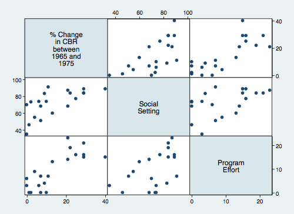

##Sample Log

We read the program effort data from the course website and list the
first three observations

```stata
use http://data.princeton.edu/wws509/datasets/effort
list in 1/3
```
Next we draw a scatterplot matrix

```stata
graph matrix change setting effort
graph export sample.png, width(500) replace
```


That's all folks!
